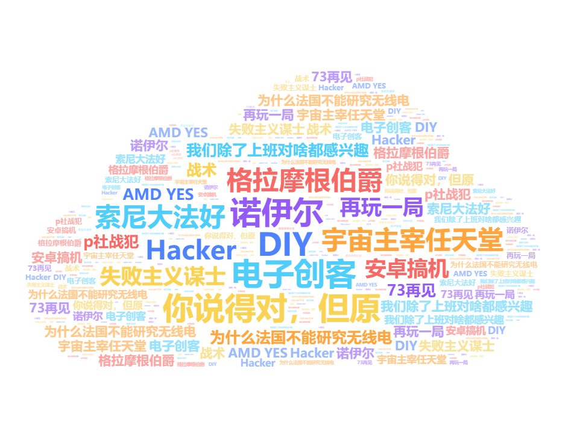

「我们的目标是星辰大海」

   
  

<h2 align="center">💻 Tech Stack</h2>

### 🌐 Frontend

### ⚙️ Backend

### 🗄️ Databases & Storage

### 🐳 DevOps & Tools

### ☁️ Cloud & Hosting

<h2 align="center">个人分享</h2>

<!-- ## 个人分享 -->
- 🌐网站导航：https://mynavar.netlify.app/
- 📁资源分享：https://fileshare.arnoliu.top/
- ~~📰个人博客-博客园：https://www.cnblogs.com/arno-liu/~~ 
- ~~📰自建博客-[Arno的可爱博客](https://halo.liuyf7.top/)~~
- 🔮个人博客-Notion专栏：『CS人类的自我修养』--[链接1](https://cs.super.site)~[链接2](https://arnoliu.notion.site/CS-89f02f72f1264efe94dfc4b7d396d8ee) 
- 🍕分享日常-知乎：https://www.zhihu.com/people/liu-yi-fei-82-83

<h2 align="center">成分</h2>

  

<!--    -->

  

